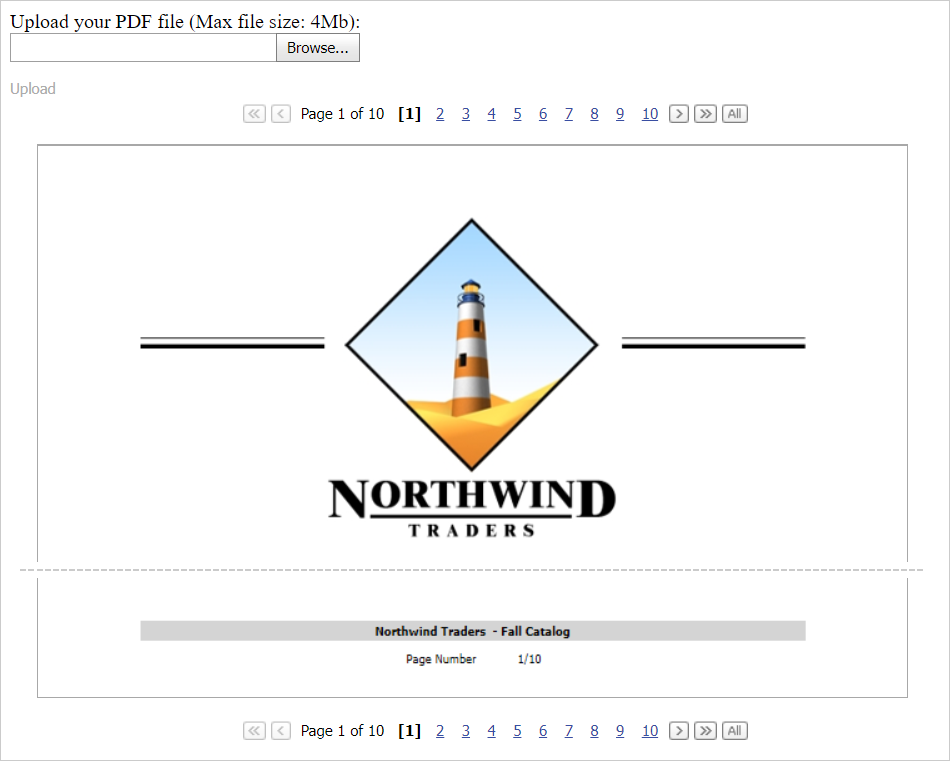

<!-- default badges list -->

<!-- default badges end -->
# PDF Document API for ASP.NET Web Forms - How to implement a PDF viewer

This example demonstrates how to use the [Office File API](https://docs.devexpress.com/OfficeFileAPI/14911/office-file-api) and [ASP.NET Web Forms Controls](https://docs.devexpress.com/AspNet/7873/aspnet-webforms-controls) to implement a custom PDF viewer. This PDF viewer displays a PDF document's content as images and allows users to navigate through document pages.

> You need an active license for the [DevExpress Office File API Subscription](https://www.devexpress.com/products/net/office-file-api/) or [DevExpress Universal Subscription](https://www.devexpress.com/subscriptions/universal.xml) to use the **Office File API** library in production code.

## Overview

Use the following classes to implement the PDF viewer:

* [PdfDocumentProcessor](https://docs.devexpress.com/OfficeFileAPI/DevExpress.Pdf.PdfDocumentProcessor)  
Allows you to manage PDF files. The **PdfDocumentProcessor**'s [LoadDocument](https://docs.devexpress.com/OfficeFileAPI/DevExpress.Pdf.PdfDocumentProcessor.LoadDocument(System.IO.Stream-System.Boolean)) method opens a PDF document and the [CreateBitmap](https://docs.devexpress.com/OfficeFileAPI/DevExpress.Pdf.PdfDocumentProcessor.CreateBitmap(System.Int32-System.Int32)) method converts the document's pages to images.

* [ASPxBinaryImage](https://docs.devexpress.com/AspNet/11646/components/data-editors/binaryimage)  
Displays a PDF document's pages as images.

* [ASPxDataView](https://docs.devexpress.com/AspNet/8280/components/data-and-image-navigation/dataview)  
Allows users to navigate through pages.

* [ASPxUploadControl](https://docs.devexpress.com/AspNet/8298/components/file-management/file-upload)  
Allows users to upload a PDF document to the server.

* [ASPxCallbackPanel](https://docs.devexpress.com/AspNet/DevExpress.Web.ASPxCallbackPanel)  
Opens a document in the PDF viewer after a user uploads the PDF document to the server.

<!-- default file list -->

## Files to Look At

* [Default.aspx](./CS/Default.aspx) (VB: [Default.aspx](./VB/Default.aspx))
* [Default.aspx.cs](./CS/Default.aspx.cs) (VB: [Default.aspx.vb](./VB/Default.aspx.vb))
* [PdfViewer.ascx](./CS/PdfViewer.ascx) (VB: [PdfViewer.ascx](./VB/PdfViewer.ascx))
* [PdfViewer.ascx.cs](./CS/PdfViewer.ascx.cs) (VB: [PdfViewer.ascx.vb](./VB/PdfViewer.ascx.vb))

<!-- default file list end -->

## Documentation

- [PDF Document API](https://docs.devexpress.com/OfficeFileAPI/16491/pdf-document-api)
- [How to Export a PDF Document to a Bitmap](https://docs.devexpress.com/OfficeFileAPI/120344/pdf-document-api/examples/export-a-pdf-document-to-an-image/how-to-export-a-pdf-document-to-a-bitmap)

## More Examples

- [PDF Document API for ASP.NET MVC Extensions - How to implement a PDF viewer](https://www.devexpress.com/Support/Center/p/E5101)
